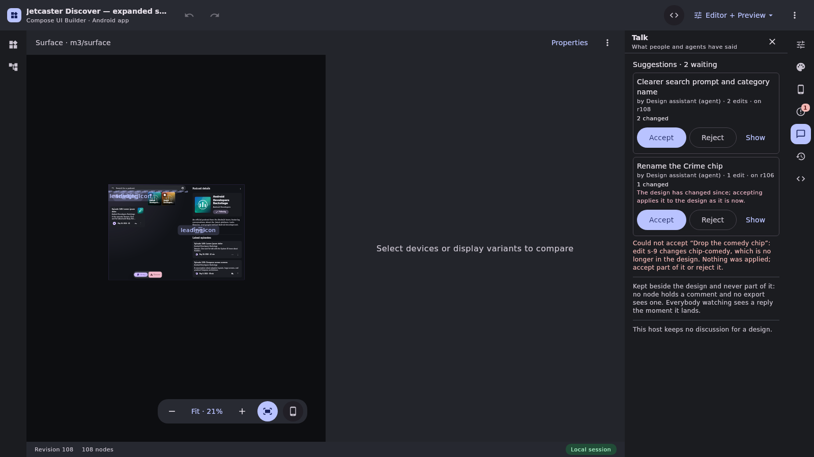
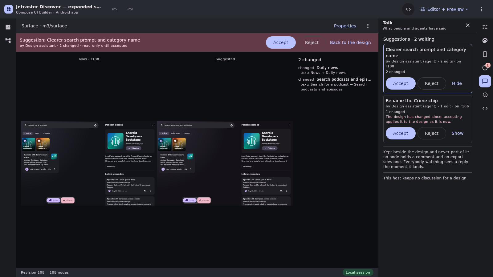

# Design branches: fork from a revision, explore, replay-merge back

Phase 2 (runtime half) of [compose-ui-builder#375](https://github.com/yschimke/compose-ui-builder/issues/375),
part of [compose-preview-server#1235](https://github.com/yschimke/compose-preview-server/issues/1235).
Phase 1, the MCP history tools, is
[compose-preview-server#1256](https://github.com/yschimke/compose-preview-server/issues/1256).
Phase 4, suggestion mode, is [Suggestions](#suggestions-open-question-3-phase-4) below.

A branch exists so an agent (or a person) can **explore an alternative**, or change a design
**without trampling somebody editing it live**, and then bring the chosen result back. It adds no
new merge algorithm. There is one merge in this system — the reducer in
[`PersistentUiBuilderService`](../../ui-builder-runtime/src/main/kotlin/ee/schimke/composeai/uibuilder/service/PersistentUiBuilderService.kt)
— and a branch comes home the way a browser checkout does: as the commands authored on it, replayed
through that reducer ([`UI_BUILDER_DESIGN_PORTABILITY.md`](UI_BUILDER_DESIGN_PORTABILITY.md)).

## The model

**A branch is a design.** It has its own design id, and every ordinary request works on it: open,
subscribe, `ApplyOperation` (which is how a branch is edited), export, thumbnail. That is what makes
the phase-3 picker cheap — rendering five alternatives is rendering five designs. What makes it a
branch is a record stored with it (`DesignBranchRecordV1`):

| Field | |
| --- | --- |
| `parentDesignId` | the design it forked from |
| `forkRevision`, `forkDocumentHash` | the fork point, and the parent's document hash there |
| `parentCreatedAtEpochMillis` | tells the parent from a design later re-created under the same id |
| `name`, `ownerActorId` | the owner is the principal when the creator acts for one |
| `status` | `OPEN`, `MERGED` or `ARCHIVED` |
| `closedAt`, `closedBy`, `mergedAtParentRevision`, `supersededByBranchId` | what became of it |

and **its command log**: every command accepted on the branch since the fork, in order, exactly as
submitted. The log is not the history window (`retainedCommittedOperations`), which is pruned and
which an asset upload cuts; a merge needs all of it, so it is kept whole and bounded instead by
`MAXIMUM_BRANCH_COMMANDS` (1,024).

The branch's document starts as the parent's document at the fork revision, under the branch's id,
**at the fork's revision number** — revision 7 of a branch forked at 5 is "the fork and two edits".
It has no `home`: a branch lives only on this service, and its way back to the parent's home is the
merge. Its undo stack starts at the fork.

### What a branch refuses

- **Edits once closed.** A merged or archived branch's log is the record of what was merged or
  abandoned; growing it afterwards would make that record untrue.
- **Whole-document changes**: an asset upload, a restore, a catalog upgrade, a document replacement,
  a home move. None of them is an operation a log can carry — an upload is a commit without one, and
  a restore is bound by hash to the branch's own document — so a merge would drop or refuse them.
  Refused at the door instead of lost at the merge.
- **Being branched.** Branches of branches are not in this phase; branch the parent.

### The port

[`UiBuilderBranchPort`](../../ui-builder-runtime/src/main/kotlin/ee/schimke/composeai/uibuilder/service/UiBuilderBranchPort.kt):
`CreateBranch {designId, name, revision?, branchId?}`, `ListBranches {designId, includeClosed}`,
`GetBranch`, `ArchiveBranch`, `MergeBranch {branchId, dryRun, skipOperationIds}`.

It is a **separate port**, not new variants of `UiBuilderServiceRequest`. That hierarchy is sealed
and the host matches it exhaustively (its grant scoping, its route table), so a new variant would be
a compile break in every host the day it was released. A separate port is additive:
compose-preview-server keeps compiling against this release and wires branches when it adds the MCP
tools. The port speaks runtime types rather than `ui-builder-protocol` wire shapes, like
`RenameDesign` and `ListRevisions` before it; the MCP tools define their own `outputSchema` (R2).

## Merge

`MergeBranch` replays the branch's log onto the parent's **current** revision with the replay the
browser's Sync runs —
[`replayCommandLog`](../../ui-builder-export/src/commonMain/kotlin/ee/schimke/composeai/uibuilder/replay/CommandLogReplay.kt),
in `:ui-builder-export` because that is the module both the browser and the service compile — so
the two cannot drift:

- **The base chain.** `base(c₁)` is the fork revision; `base(cₖ)` is the revision `cₖ₋₁` landed at.
  It is what each command's positions resolve against.
- **Staleness from the fork.** Every command's `STALE_*` checks read the window from the fork to
  the parent's head when the merge began (`StalenessWindow` in the reducer), not the window after
  its own base: the author of `cₖ` saw the fork and `c₁…cₖ₋₁`, and none of the parent's edits since.
  So `c₃` overwriting a property the parent changed after the fork is reported however late in the
  log it comes, and `overwrittenRevision` names that parent head (for an environment field, the
  parent revision that last wrote it). A key an earlier command of the
  same replay already wrote is not reported again — the later command overwrites the branch's own
  value, which its author saw. A skip or a partial accept changes which command replays first, and
  so changes nothing about what any of them reports.
- **Every command replays as itself**, undos and redos included.
- **The first refusal stops the run**, and the report says where and why and how much is left.
- **A per-command report**: for each command, its author, its base, where it landed, and what it
  overwrote (`STALE_PROPERTY_WRITE`, `STALE_MOVE`, …), or the rejection code that stopped it.

### All or nothing, where Sync is prefix-commit

Sync commits each command as it lands, because each is its own HTTP request and the run is
resumable through idempotent replay: the landed prefix answers as already-there on a re-run. A
branch merge runs inside the service lock, so it can do better and does: it replays onto a
**working copy** of the parent and commits only when **every** command landed. A refusal leaves the
parent, the branch and its siblings exactly as they were, and spends none of the log's operation
ids, so the same merge can run again. The report has the same shape either way.

A **dry run** is exactly that replay with the commit left out. It reports what would land, what it
would overwrite, where it would stop and which siblings it would archive, and writes nothing to
either design.

### Resolving a refusal

The log is history and is never rewritten. A refused merge is resolved by a decision made at merge
time: `skipOperationIds` leaves named commands out of the replay (the report lists them), for a
command that should not land any more — an edit of a node the parent has since deleted, a delete of
something somebody has edited since. Skipping a command an undo in the log targets makes that undo
refuse (`UNKNOWN_OPERATION`), so skip both. Anything else — a different intent — is a new branch
from the parent's head. `cherry_pick {branchId, operationIds}` from #375 is the complement of a skip
and is a follow-up.

### After a merge

The parent gains one revision per replayed command (the price Sync already pays: revisions are
cheap, a merge nobody can explain is not), and its subscribers receive them as one delta — or a
snapshot if the run is longer than the delta window. The branch becomes `MERGED` with
`mergedAtParentRevision`; its **siblings** — open branches of the same parent forked at the same
revision, which are the alternatives it was chosen from — become `ARCHIVED` with
`supersededByBranchId` pointing at it. They are kept, readable and listable, not deleted. Branches
forked elsewhere are not siblings and stay open.

## Attribution (open question 1)

**Each replayed command keeps its original author; the merge is recorded separately.** Every
revision the merge adds to the parent is attributed — in the operation log, the audit and
`ListRevisions` — to the actor that authored that command on the branch. The merging actor is
recorded on the branch record (`closedByActorId`).

Not a "merge actor" on each command, because undo is per author (`ACTOR_MISMATCH`): attributing the
run to the merger would leave the author unable to undo their own work after it lands, and make every
conflict notice name the wrong person. This is the same choice Sync made for its single offline
author, generalised to a branch two people (or a person and an agent) edited. The author ids come
from the branch's own log, which only the service wrote — never from a request — so this is not a
request asserting an identity. The merging actor needs write on the parent; the authors' access to
the parent is not re-checked, because the person merging is the one vouching for the change.

## Access and comments (open question 2)

**Inherited.** A branch's access list *is* its parent's: copied at the fork and rewritten on every
branch whenever the parent's access changes, with the branch's subscribers revoked as the parent's
are. Whoever may read the design may read the alternatives being explored for it, and somebody
removed from it loses them too. A branch has no access list of its own to manage, and owner-only
actions (deleting it) stay with the parent's owner. The branch's own `ownerActorId` is attribution
and the right to archive it, not an access grant. Archiving needs that ownership or write on the
parent; creating and merging need write on the parent.

Comments are a sidecar keyed by design id, so a branch's comments are its own and are not carried
across a merge. The review flow #375 describes — the agent comments on the parent linking the
branch — is a comment on the parent, which is where it belongs. Carrying branch comments across is a
follow-up if it is ever wanted.

## Retention pinning

An open branch's fork revision is **pinned** in the parent: its document snapshot and its position
snapshot are kept however far the parent moves on, so retention (`retainedRevisionSnapshots`,
`retainedRevisionBytes`) can never refuse a merge for the age of its base alone. The conflict-touch
window follows, because it is pruned against the oldest retained position snapshot — an open branch
keeps the evidence its merge's staleness checks read.

- Pins are **derived** from the branch records, not stored on the parent, so a crash between writing
  a branch and its parent cannot leave them disagreeing.
- Archiving or merging releases the pin at the parent's next commit.
- The snapshot floor a client is told (`retainedFromSequence` on `SNAPSHOT_REQUIRED`) is the
  unbroken run of revisions ending at the head, not the pinned one below a gap.
- A **content replacement** on the parent (`ReplaceDesignDocument`) still cuts every older base, as
  it does for a live editor: the fork's document is kept (for comparison), its position state is
  not, and the merge's first command is refused `REVISION_NOT_RETAINED` rather than replayed onto a
  document nobody's edits were authored against. A restore or catalog upgrade on the parent is an
  ordinary commit, and the merge treats it as any concurrent edit.

A pin costs one retained revision per open fork point plus the touch window back to it. An
abandoned branch holds that until it is archived; listing open branches is how an operator finds
them.

## How it relates to browser checkout and Sync

The same thing in two places. A browser checkout is a branch whose log lives in IndexedDB and
whose merge goes over HTTP; a server branch is a checkout whose log lives in the service and whose
merge runs under the service lock. They share the replay (`replayCommandLog`) and its report shape;
they differ only in transport, and so in atomicity. Sync was refactored onto the shared loop in this
change, and `LocalDesignSyncBackTest` still holds it to the same answers.

## Suggestions (open question 3, phase 4)

**Suggestions are short-lived branches under the hood.** There is no second mechanism: a suggestion
is a branch whose record says `kind = SUGGESTION`, a person accepts it with the merge and rejects it
with the archive. What phase 4 adds is the kind, a partial accept, and the editor that shows them.

| | |
| --- | --- |
| Propose | `CreateBranch {designId, name = summary, kind = SUGGESTION}` at the head, then ordinary applies on the suggestion's id |
| List | `ListBranches {designId, includeClosed = false, kind = SUGGESTION}` |
| Accept | `MergeBranch {branchId}` — the replay-merge above, all or nothing, per-command report |
| Accept part | `MergeBranch {branchId, acceptOperationIds}` — every logged command not named is skipped |
| Reject | `ArchiveBranch {branchId}` — by a writer on the design, or by the suggestion's author withdrawing it |

### What differs from a branch

- **The record carries `kind`.** `DesignBranchRecordV1.kind` is never written for an ordinary
  branch, so a branch stored before suggestions existed reads back unchanged. The port reports it as
  `UiBuilderBranch.kind`, and `UiBuilderBranch.operationIds` lists the log in order so a caller can
  name a partial accept without reading the log some other way.
- **Accepting one archives nothing.** A branch's siblings are the alternatives it was chosen from; a
  suggestion is a proposal, and two suggestions made at the same revision are two proposals.
  Merging a suggestion archives no sibling, and merging a branch never archives a suggestion that
  shares its fork point.
- **A retried create matches on kind too**, so the same id cannot be a branch on one call and a
  suggestion on the next.
- **Accepting none of it is a reject.** `acceptOperationIds = {}` is refused (`BAD_REQUEST`) rather
  than recorded as a merge that changed nothing.

Everything else is the branch's: inherited access, the fork-point pin (a waiting suggestion pins its
revision like any open branch), the 1,024-command cap, per-author attribution — an accepted
suggestion's revisions are the agent's, so the agent can still undo its own change — and the
all-or-nothing replay. A suggestion made at an older revision still accepts, replayed onto the head;
its report says what it overwrote.

### In the editor

The comments ("Talk") tab gains a **Suggestions** section above the review verdict, when the host
supports suggestions or has any to report:

- **One card per open suggestion**: its summary (the branch name), who proposed it and whether that
  is an agent, how many edits, the revision it was made on, and a one-line document diff ("1 added ·
  2 changed"). The diff is `documentDiff` between the design **at the suggestion's fork revision**
  (rebuilt from the editor's own record when it can be) and the suggestion's head, so it is the
  suggestion's own change; out of reach, it falls back to the design as it is now. A card notes
  when the design has moved on since the suggestion was made.
- **Show** swaps the canvas for a read-only review pane — the design now and the design as the
  suggestion would leave it, side by side, drawn by the canvas's own renderer, with the change
  list — the way an old revision replaces the canvas rather than being drawn over it.
- **Accept** and **Reject** go to the host. The outcome is said under the list: what landed and
  at which revision, what it overwrote (`STALE_*` notices, in words), or — for a refused accept —
  which command stopped it and why, and that nothing was applied.

`UiBuilderEditor` takes `suggestions`, `onAcceptSuggestion`, `onRejectSuggestion` and
`suggestionStatus`, all defaulting to nothing, so the section is not drawn on a host without
suggestions: the MCP App host, the local (browser-storage) host, every preview and every test that
does not ask for it. The browser host (`BrowserSuggestionHost`, wasmJs) lists through the server's
suggestion routes and opens each suggestion's document through the ordinary `OpenDesign` protocol
request by the suggestion's id — it is a design, and it inherits the design's access, so no new
document route is needed. It polls the list every 15 s (a suggestion arriving does not move the
design, so nothing comes down the socket for it) and stops at the first answer that is not a list,
which is what a host without the routes gives. An accepted suggestion reaches the canvas as the
ordinary delta.

Both are `UiBuilderSuggestionsPreview.kt`, so the preview workflow diffs them.

The partial accept is in the port and the browser host (`accept(suggestion, acceptOperationIds)`);
the editor's cards accept or reject the whole suggestion. Per-operation checkboxes are a follow-up.

## Known limits and follow-ups

- **Sync still checks staleness against the chain base.** The merge's fork window is passed to the
  reducer in-process; Sync replays over the wire, one `ApplyOperation` per command, and
  `DesignCommandV1` carries one base revision, so the server cannot tell an offline run's `c₂` from
  a live edit made at that revision. A Sync `c₂…cₙ` that overwrites a server edit made between the
  fork and the sync is still applied with no `STALE_*` notice. Fixing it is a wire change — a
  second, optional revision on the command in compose-preview-contracts (the "staleness base"),
  which the service would turn into the same `StalenessWindow` — so it needs a contracts release
  and every client that sends it, and is tracked separately.
- **The stale delete/restore gate reads the chain base.** A delete or restore whose base is behind
  the head is refused (`REVISION_MISMATCH`), which in a merge only `c₁` can be; a later delete
  lands even if the parent edited the node after the fork. Widening the gate to the fork window
  would refuse every non-first delete once the parent has moved at all, which is a policy change
  rather than a reporting one, so the dry-run report is still the review surface for it.
- **Document diff for the server.** `revisionDiff`/`documentDiff` (`editor/RevisionTimeline.kt`)
  works on the editor's `UiBuilderDocument` and `CapabilityCatalog`, so moving it into a module the
  server consumes is not a small change; compose-preview-server#1256's `diff_designs` needs it, and
  it should move to `:ui-builder-export` (or the runtime) rather than be forked.
- **Assets on a branch** are refused (above). Content-addressed assets would let a branch upload and
  a merge carry the binding.
- **Deleting the parent** leaves its branches readable; a merge answers `NOT_FOUND`.
- **Concurrent editors on one branch** are replayed as a sequence in log order, as Sync replays one
  author's offline run.

## What the server wires next

In compose-preview-server, after the release carrying this:

- MCP tools `branch_design {designId, name, revision?}`, `list_branches {designId}` and
  `merge_branch {branchId, dryRun?, skipOperationIds?}` (plus `archive_branch`), each with an
  `outputSchema` and listed in `docs/design/CATALOG_MCP.md`, through `UiBuilderBranchPort`.
- **Grant scoping**: an agent grant scoped to a design must reach its branches. A branch's design id
  is not its parent's, so the scope check maps a branch id to its `parentDesignId` (via `GetBranch`).
- Edits keep going through the existing apply tool against the branch id.

### For suggestions

compose-preview-server already wires the branch tools through `UiBuilderBranchPort`; suggestions
need, after the release carrying phase 4:

- MCP tools, each with an `outputSchema` and listed in `docs/design/CATALOG_MCP.md`:
  - `ui_builder_suggest {designId, summary, operations}` — `CreateBranch {kind = SUGGESTION}` at
    the head, then the operations applied on the suggestion's id; answers the suggestion and the
    outcome of each operation. One call, so an agent cannot leave an empty suggestion behind.
  - `ui_builder_list_suggestions {designId}` — `ListBranches {kind = SUGGESTION, includeClosed =
    false}`.
  - `ui_builder_accept_suggestion {suggestionId, operationIds?}` — `MergeBranch` with
    `acceptOperationIds`; answers the merge report.
  - `ui_builder_reject_suggestion {suggestionId}` — `ArchiveBranch`.
- HTTP routes for the editor, which `BrowserSuggestionHost` already calls (payloads in
  `DesignSuggestionWire.kt`, `:ui-builder` commonMain):
  - `GET /api/ui-builder/v1/designs/{id}/suggestions` → `{"suggestions": [{"suggestionId",
    "summary", "proposedBy", "proposerKind": "agent"|"human", "displayName"?,
    "createdAtEpochMillis", "forkRevision", "operationIds"}]}`;
  - `POST …/suggestions/{suggestionId}/accept`, body `{"acceptOperationIds"?: [...]}` → the merge
    report (`merged`, `parentRevisionAfter`, `commands[]` with `status`, `code`, `nodeId`,
    `conflicts[]`, `skippedOperationIds`) — a refused merge is a 200 report with `merged: false`;
  - `POST …/suggestions/{suggestionId}/reject` → the archived suggestion.
  The decider is the credential, as for review decisions; `proposerKind` comes from the owner's
  principal kind.
- Grant scoping already maps a branch id to its parent; a suggestion is a branch, so nothing new.
- The collaboration rule for compose-ag-plugin's `docs/agent-rules.md`: when a person is present on
  a design, an agent proposes with `ui_builder_suggest` rather than applying to it directly.
