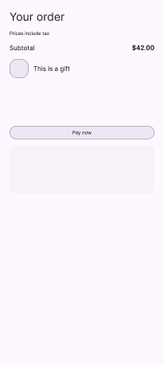

# The UI builder and Figma, Stitch and Claude Design

**Status: import, scene export and round trip built in `:ui-builder` (2026-09); the plugin half lives in design-parity.** What a good integration between this
editor and the design tools people already use looks like, why copying SVG back and forth is not it,
and the order the pieces land in. It reuses what already exists — this repository's SVG export and
reference overlay, and `yschimke/design-parity`'s Figma adapter, kit index and Figma plugin — rather
than starting a third implementation of "read a Figma frame".

## The short answer

**Identity is the missing piece, not a file format.** A design only round-trips through Figma if a
node that goes out comes back as *the same node* — and the reducer already knows what to do with a
set of edits authored against an old revision: it is the offline collaborator of
[`UI_BUILDER_DESIGN_PORTABILITY.md`](UI_BUILDER_DESIGN_PORTABILITY.md), whose round trip took a day
instead of eight milliseconds. So:

1. **Figma → builder** reads a frame as a **snapshot** (a small, tool-neutral JSON tree), maps the
   component instances in it to catalog components through a committed **map**, and emits an
   **operation log** — `createDesign` then one `insertNode` per node — that the existing reducer
   replays and the existing validator checks. Anything the map cannot place becomes a sized
   placeholder and a named diagnostic, never a guessed component.
2. **Builder → Figma** projects a saved revision into a **scene**: auto-layout frames that mirror the
   Row/Column/Box tree, component instances of the kit where the map knows one, and text — every
   node stamped with `{designId, nodeId, revision}`. A Figma plugin (or an agent through the Figma
   MCP) builds the scene; nothing in this repository talks to Figma.
3. **Round trip** reads the stamped frame back as a snapshot, diffs it against the revision it was
   exported from, and turns the difference into `SetProperty` / `MoveNode` / `DeleteNode` /
   `InsertNode` operations submitted **at that base revision** through
   [`CollaborationReducer`](../../ui-builder/src/commonMain/kotlin/ee/schimke/composeai/uibuilder/CollaborationReducer.kt).
   Conflicts are the reducer's ordinary per-property conflicts. Deletions, which the reducer only
   accepts at the current revision, travel as a second command the host confirms.

Stitch and Claude Design produce no component tree with stable identity, so they enter through the
reference overlay and an agent, and through Figma when they can paste into it.

## What exists today, and what it can and cannot do

| Piece | Where | What it does | What it cannot do |
| --- | --- | --- | --- |
| Structured SVG export | `StructuredSvgExportBridge.kt`, `JvmSkiaStructuredSvgRecorder.kt` | Records the clean render through Skia's SVG canvas; the desktop host puts it on the clipboard for "paste into Figma" | Skia emits flat draw operations: no group per authored node, no layer names. Only `<text>` and raster `<image>` carry `data-compose-node-id`. |
| The Figma import gate | [`fixtures/ui-builder/jetcaster-discover-figma-import-v1.json`](fixtures/ui-builder/jetcaster-discover-figma-import-v1.json) | Evidence of the last real import: 1 frame, 129 groups, 83 vectors, 37 text, 5.6 % raster mismatch | Status `no-go`. The picture lands; the structure does not. A designer receives vectors, not a Button. |
| Reference overlay | [`UI_BUILDER_REFERENCE_OVERLAY.md`](UI_BUILDER_REFERENCE_OVERLAY.md) | Paste Figma's "copy as PNG" or an SVG, compare, mark up, promote a *captured* piece into a real node | Deliberately pixels only; refuses to decide which component a piece with no provenance is. |
| Links record | [`UI_BUILDER_LINKS.md`](UI_BUILDER_LINKS.md) | `reference` holds the Figma node URL a design reproduces | Never fetched: this host holds no design-tool credential. |
| Figma adapter | design-parity `packages/adapters/figma` | REST client, `FigmaNodeDoc`, `parseVariantName`, Code Connect loader | Its layout reader flattens the tree; it has no instance → catalog mapping. |
| Kit index | design-parity `packages/kit-index` | Catalog knob (`size=l`) → the exact kit variant node | Forward only; no kit node → catalog knob. |
| Page backdrop | design-parity `packages/page-backdrop` | Walks a page's instances and links each to code (Code Connect → `design-map.json` → name) | Links to *code*, not to a catalog node with properties. |
| Figma plugin | design-parity `packages/figma-plugin` | Places catalog renders, stamps nodes (`designParity` shared plugin data), reconciles by identity, reads a frame for "Handoff to code" | Reads component *names* only; has no builder task. |

Two facts from that table decide the design:

- **The SVG lane can be made traceable, not structural.** Stamping the node id into the fragments
  that already carry `data-compose-node-id` helps a human find a node in Figma's layer list. It does
  not give Figma a component, auto layout or a variable, because the geometry arrives as Skia draw
  calls. SVG stays the universal fallback — the one format Stitch, Claude Design and a browser all
  read — and stops being the Figma integration.
- **Identity stamps and reconcile-by-identity are already a solved pattern** next door. The plugin's
  v2 import stamps every node and re-imports by `componentId`, never by position, and never touches
  an unstamped node. The builder integration uses the same rule with its own namespace.

## Three contracts

All three are JSON and versioned. The plugin and any agent read and write them; neither side links
against the other.

**Ownership moves at v1.** While the shapes are still settling, this repository owns them, so a
change is one pull request here rather than a `compose-preview-contracts` release plus a pin bump in
every consumer. They move to `compose-preview-contracts`, as versioned JSON Schemas, when they reach
v1. That happens when the first route outside this repository accepts or returns one: a
compose-preview-server host route or MCP tool that imports a snapshot or serves a scene. From then on
they are cross-repository wire formats. design-parity's TypeScript checks its payloads against the
published schema instead of a hand-copied type, and the server reads them without depending on
`:ui-builder`.

- **Snapshot and scene** move at that point: each is a single message crossing a repository
  boundary.
- **The map** moves only if something outside this repository has to read it. It describes a
  catalog rather than a message, and it is pinned to the catalog's system id and revision, so until
  then it stays next to the catalog it maps.

### `compose-ui-builder-figma-snapshot/v1` — a Figma frame, as read

What a plugin (or `use_figma`) reads from a selection. Deliberately close to what the Figma plugin
API exposes on a node, and deliberately **not** Figma's REST document: the REST tree does not carry
`layoutSizingHorizontal`, bound variables on a paint are shaped differently, and a plugin can read
shared plugin data the REST API never sees.

```json
{
  "schema": "compose-ui-builder-figma-snapshot/v1",
  "source": { "fileKey": "abc…", "nodeId": "12:34" },
  "root": {
    "id": "12:34", "type": "FRAME", "name": "Checkout", "width": 412, "height": 915,
    "layout": { "mode": "VERTICAL", "itemSpacing": 16,
                "padding": { "left": 24, "top": 24, "right": 24, "bottom": 24 },
                "primaryAxisAlign": "MIN", "counterAxisAlign": "MIN" },
    "sizing": { "horizontal": "FIXED", "vertical": "FIXED" },
    "fill": { "color": "#FFFEF7FF", "variable": "Schemes/Surface" },
    "cornerRadius": 0,
    "stamp": { "designId": "checkout", "nodeId": "root", "revision": 41 },
    "children": [
      { "id": "12:40", "type": "INSTANCE", "name": "Button",
        "instance": { "componentSet": "Button", "component": "Style=Filled, State=Enabled",
                      "properties": { "Style": "Filled", "State": "Enabled", "Label text": "Pay" } } },
      { "id": "12:41", "type": "TEXT", "name": "Total",
        "text": { "characters": "Total", "style": "M3/title/large", "fontSize": 22, "fontWeight": 400 } }
    ]
  }
}
```

`instance.properties` merges the variant axes (from the main component's name) with the instance's
own component properties, keys stripped of Figma's `#12:0` suffix — the same normalisation
design-parity's `propertyName` and kit-index `walkPage` already perform. `stamp` is present only on a
node this editor exported.

### `compose-ui-builder-figma-map/v1` — which Figma component is which catalog component

The correspondence, committed, so an import is deterministic and reviewable. It is the builder's
counterpart of design-parity's `design-map.json` + kit index: those map *code previews* to kit
nodes; this maps *kit instances* to catalog nodes with properties.

```json
{
  "schema": "compose-ui-builder-figma-map/v1",
  "catalog": "m3-catalog",
  "components": [
    { "componentSet": "Button", "when": { "Style": "Filled" },
      "componentId": "m3/button",
      "constants": { "style": "filled" },
      "properties": { "enabled": { "from": "State", "values": { "Enabled": true, "Disabled": false } } },
      "text": { "slot": "content", "from": "Label text" } }
  ],
  "colorVariables": { "Schemes/Surface": "surface", "Schemes/Primary": "primary" },
  "textStyles": { "M3/title/large": "titleLarge" }
}
```

- `componentSet` names the set (or a standalone component); `when` narrows by property values. The
  first rule that matches wins, so the more specific rule goes first.
- `properties` translates one Figma property into one catalog property through `values`; without
  `values` the Figma value passes through (text and booleans).
- `text` puts an `m3/text` child in a slot, its text taken from a Figma text property — the common
  "label on a button" case.
- `colorVariables` and `textStyles` turn a bound variable or a text style into a **token**, so an
  imported fill is `colorToken: surface`, not a hex that stops following the theme.

The seed map for `m3-catalog` lives beside the capability file,
`fixtures/ui-builder/m3-catalog-figma-map-v1.json`.
Its names follow the Material 3 Design Kit; a project with its own kit commits its own map. When a
catalog publishes its Figma references (the `reference = "figma:…"` proposal in
[`UI_BUILDER_CATALOG_CONTRACT.md`](UI_BUILDER_CATALOG_CONTRACT.md)) the map can be generated from
that and from Code Connect instead of written by hand; the shape does not change.

### `compose-ui-builder-figma-scene/v1` — a saved revision, as Figma should build it

What the export produces and a plugin executes: a tree of `frame`, `instance`, `text` and
`placeholder` entries with auto-layout settings, fills as token-or-hex, and a stamp on every entry.
An `instance` names the kit component by set and variant properties — the plugin resolves it to a
component key in the open file or a library (the kit index already knows how) and falls back to a
labelled frame when the kit is not available, so a scene always builds.

## Import: Figma → builder

`FigmaSnapshotImporter` (in `:ui-builder`, `commonMain`, package `…uibuilder.figma`) walks the
snapshot once, depth first:

| Figma node | Becomes |
| --- | --- |
| `INSTANCE` matched by the map | the mapped catalog component, properties from the rule, optional text child; the instance's own children are not walked |
| `INSTANCE` not matched | a `layout/box` of the instance's size, plus an `unmapped-instance` diagnostic naming the set, the component and the node id |
| `TEXT` | `m3/text`: `text`, `style` from the text-style map, else `fontSizeSp` and `fontWeight`; `color` from the fill |
| `FRAME` / `COMPONENT` / `GROUP` with `layout.mode` `HORIZONTAL` | `layout/row`: `horizontalSpacingDp`, `horizontalArrangement`, `verticalAlignment` |
| … with `VERTICAL` | `layout/column`: `verticalSpacingDp`, `verticalArrangement`, `horizontalAlignment` |
| … with no auto layout | `layout/box`; each child keeps its position through an `offset` modifier, and an `absolute-layout` note says so |
| `RECTANGLE` / `ELLIPSE` without an image fill | a sized `layout/box` with its background and corner clip |
| anything else (vectors, image fills, boolean operations) | a sized placeholder and an `unsupported-node` diagnostic |

Modifiers follow Compose order: sizing (`FILL` on the parent's main axis → `weight`, on the cross axis
→ `fillMaxWidth`/`fillMaxHeight`, `FIXED` → `width`/`height`), then `clip`, then `background`, then
`padding`. The root frame sets the environment's `widthDp`/`heightDp` and takes `fillMaxSize`.

**Why a placeholder and not nothing.** Dropping an unmapped node would reflow everything after it,
and the design would stop resembling the frame it came from. A sized, empty box keeps the layout
honest, the diagnostic says exactly what to build there, and the reference overlay — a screenshot of
the same frame — shows what it looked like. This is the overlay's "a hole the size of the thing" rule
applied at import. What the importer never does is pick a catalog component the map did not name:
the reducer refuses to guess which component an unprovenanced piece is, and so does this.

Node ids come from the stamp when there is one (so a round trip keeps them) and otherwise from the
Figma id (`figma-12-40`), which is stable across re-imports of the same frame. A stamp is trusted
only when it is from the same export as the frame's root and is the first to claim its id: a
designer who duplicates a node copies its stamp, and a subtree pasted from another design brings
someone else's, and both are new nodes. Siblings are chained
through `afterNodeId`, because the candidate reducer prepends when it is absent.

The output is an operation log in the existing `compose-ui-builder-operations/v1-candidate` shape,
so it replays with `UiBuilderReducer.replay`, validates with `CapabilityValidator`, exports with the
same Compose exporter, and can be committed to a project's designs directory
([`UI_BUILDER_PROJECT_DESIGNS.md`](UI_BUILDER_PROJECT_DESIGNS.md)) like any other design.

## Export: builder → Figma

`FigmaSceneExporter` projects a document into a scene. Row and Column become auto-layout frames
with the same spacing, arrangement and alignment the importer reads, so export then import is the
identity on everything the map covers — which is what the tests assert. A catalog component the map
knows becomes an `instance` with the variant properties the rule implies (the rule is run
backwards: constants and `values` inverted). A component the map does not know becomes a
`placeholder` carrying the catalog id, so a designer sees "`m3/date-picker` goes here" rather than a
silently missing element.

Every entry carries the stamp. The plugin writes it as shared plugin data under the namespace
`composeUiBuilder` — not `designParity`, whose importer owns its own nodes — and treats an
unstamped node as a designer's own content.

What the SVG lane keeps: it remains the universal export (Stitch, Claude Design and browsers read
it), and it becomes traceable cheaply by naming the fragments that already carry a node id. That is
a small follow-up in `StructuredSvgExportBridge`, not a dependency of anything here.

## Round trip

`FigmaRoundTrip.reconcile(base, scene, snapshot, …)` takes the design as it is now, the scene Figma
was given, and the same frame read back later:

1. Import the snapshot as above. Stamped nodes keep their builder ids; new Figma nodes get
   `figma-…` ids.
2. Compare the two trees node by node:
   - present in both → a `SetProperty` for each mapped property whose value changed, a
     `RemoveNodeProperty` for one that disappeared, and a `SetModifiers` when the modifier list
     differs; a node that reads back as a different component is reported, not swapped, because no
     operation changes a node's component;
   - a different parent or position → `MoveNode`;
   - only in the snapshot → `InsertNode`;
   - only in the base → `DeleteNode`.
3. Emit the edits as one `DesignCommand` at `baseRevision` = the stamped revision. The reducer
   applies it against whatever the design has become since, with its ordinary per-property conflict
   notices. Moves come before deletes, so a child a designer rescued from a deleted container is out
   of it before the container goes.
4. Emit the deletes as a second command. The reducer refuses a stale delete outright — deleting on
   the strength of an old picture of the design is the one edit it will not merge — so when the
   design has moved on since the export, the deletions are authored at the current revision instead,
   a separate command the host shows before submitting. When nothing has moved on, both fit in one.

Two rules keep this safe:

- **Only what the importer can express is compared.** A property the map does not carry (say a
  `containerColor` set in the builder that the kit has no slot for) is absent from both the scene and
  the snapshot's import, so it is never read as "removed in Figma". The comparison is over the
  import's vocabulary, not the document's.
- **Direction is a policy, not a guess.** design-parity's `.design-parity.json` already settles who
  owns the source of truth; `code-led` applies Figma edits as proposals the operator accepts,
  `design-led` applies them. The reconcile produces the command either way; the host decides whether
  to submit it.

## Verified in a real Figma file

The checkout fixture has been through the whole loop in Figma, and the files it produced are committed
so the loop stays pinned without Figma in CI:

1. `./gradlew :ui-builder:figmaTool -PfigmaArgs="export <operations.json> <scene.json>"` wrote
   [`figma/checkout-scene-v1.json`](fixtures/ui-builder/figma/checkout-scene-v1.json).
2. design-parity's plugin module (`buildUiBuilderScene`) built it in a scratch file through the Figma
   MCP's `use_figma`. With no kit in the file, the Button, Checkbox and Divider were built as stand-ins,
   and every colour variable and text style bound.
3. `readUiBuilderSnapshot` read it back untouched
   ([`checkout-figma-untouched-v1.json`](fixtures/ui-builder/figma/checkout-figma-untouched-v1.json)),
   and again after a designer's edits
   ([`checkout-figma-edited-v1.json`](fixtures/ui-builder/figma/checkout-figma-edited-v1.json)).
   The edits were: retitle, relabel the Pay button, widen a row, delete the divider, move the promo
   to the end, and add a footnote.
4. `figmaTool reconcile` turned the untouched frame into no command. It turned the edited frame into
   six operations at revision 14: one delete, one insert, one move and three property writes.
   `FigmaRoundTripTest` asserts exactly that.



Figma disagreed with the fake API in two places, and both are now handled:

- **Text colour.** Unfilled text reads back as black, so the plugin records which fills it defaulted.
- **Styled text.** Every text layer reports a size and weight even when it uses a style, so a mapped
  style owns its layer's typography.

A third issue, a move of one card reading as a move of every sibling it passed, is why moves are
computed from the longest run of siblings still in order.

## Stitch and Claude Design

Neither produces a component tree with stable identity, so neither can round-trip the way Figma can.

- **Stitch** produces HTML with Tailwind classes plus a screenshot. The screenshot goes into the
  reference overlay; the structure goes through an agent that reads the HTML and issues builder
  operations over MCP, mapping Tailwind colours to theme tokens with design-parity's existing
  `tailwind-tokens.ts`. Stitch can paste into Figma, and a pasted frame imports through the path
  above.
- **Claude Design** reads a design system from a repository through `/design-sync`. Pushing the
  catalog in (component names and tokens) makes what it generates use this editor's vocabulary; its
  output returns through an agent the same way as Stitch's. Because both ends are agents, the
  integration is the builder's MCP operations, not a file exchange.

In both cases the snapshot contract is the landing point if a tool ever exposes a tree with ids:
whatever produces a `compose-ui-builder-figma-snapshot/v1` imports, whichever tool it came from.

## Where each piece lives

Per [`UI_BUILDER_PROJECT_BOUNDARY.md`](UI_BUILDER_PROJECT_BOUNDARY.md), this repository owns the
editor's tree and the contracts that describe it; design-parity owns Figma.

| Piece | Repository | Module |
| --- | --- | --- |
| Snapshot, map and scene contracts (until v1; see [Three contracts](#three-contracts)) | compose-ui-builder | `:ui-builder` `commonMain`, package `figma` |
| Snapshot and scene contracts at v1, as JSON Schemas | compose-preview-contracts | follow-up, with the first server route |
| Importer, scene exporter, round-trip reconcile | compose-ui-builder | `:ui-builder` `commonMain`, package `figma` |
| Seed map for `m3-catalog` | compose-ui-builder | `docs/design/fixtures/ui-builder/` |
| Reading a selection into a snapshot; building a scene; stamping | design-parity | `packages/figma-plugin` (`src/uiBuilder*.ts`, pure, tested against the fake Figma) |
| Host routes / MCP tools that accept a snapshot and return operations | compose-preview-server | `:server`, `:mcp` (follow-up; until then the importer runs from tests and a command-line tool) |

`:ui-builder-export` is not touched: it is a seam compose-preview-server compiles against, and
nothing here needs to change what it publishes.

## Sequence

1. This document.
2. **Import** — snapshot and map contracts, `FigmaSnapshotImporter`, the seed `m3-catalog` map, tests
   that replay and validate the result.
3. **Export** — `FigmaSceneExporter` and the scene contract; a test that export-then-import is the
   identity on the mapped vocabulary.
4. **Round trip** — `FigmaRoundTrip.reconcile` producing a `DesignCommand`, tested through
   `CollaborationReducer` including a conflicting concurrent edit.
5. **Plugin** (design-parity) — `readSnapshot(node)` and `buildScene(scene)` over the injected
   `FigmaApi`, plus a "UI builder" task in the plugin UI.
6. **Evidence** — a scene built in a scratch Figma file, read back, re-imported, and compared.

Later, independent of each other:

- traceable SVG (layer names on the fragments that carry a node id);
- a map generated from Code Connect and the catalog's published Figma references;
- server routes and MCP tools so a browser session can import without the desktop host, which is
  also when the snapshot and scene contracts move to `compose-preview-contracts` at v1;
- `Code Connect` for Compose generated from the catalog record, so Figma's own Dev Mode and MCP show
  the catalog call for an instance.

## Not in scope

- Parsing Figma's clipboard. It is an undocumented binary format; the plugin API is the supported
  way to read a frame.
- Guessing components from geometry. An unmapped instance is a placeholder and a diagnostic.
- Pixel-level parity. That is design-parity's job, and it already compares a builder render against a
  Figma node.
- Vector artwork. A vector is a placeholder until the catalog has an artwork component the map can
  name.
