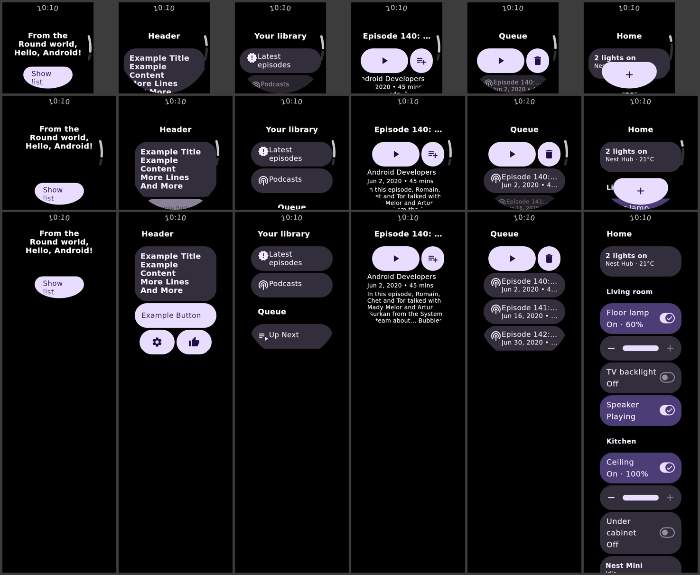
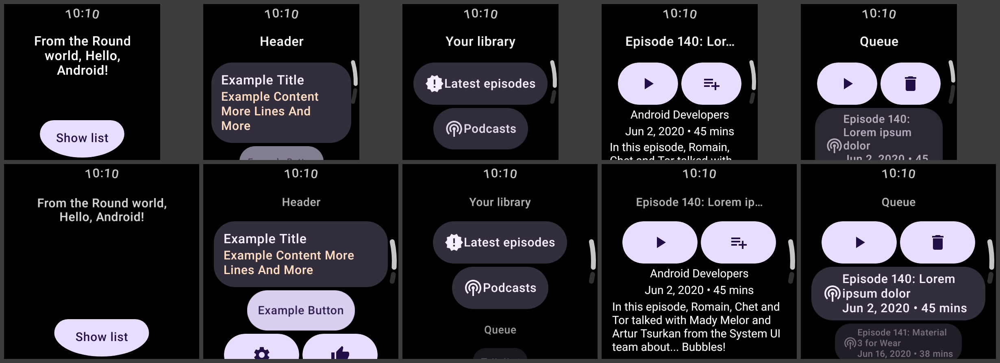

# Upstream Wear sample screens as designs, and what the generated code gets wrong

Five screens from Android's own Wear samples were transcribed as `wear-m3` designs, drawn on the
editor's canvas and device previews, exported, and compiled and rendered against real Wear Compose
Material 3. This document is the result, and mostly it is the list of places where the **generated
Kotlin departs from Google's Wear Material 3 guidance** — the
[lists guide](https://developer.android.com/training/wearables/compose/lists), the
[buttons](https://developer.android.com/design/ui/wear/guides/components/buttons) and
[cards](https://developer.android.com/design/ui/wear/guides/components/cards) component guidance,
and the upstream samples themselves, which are Google's reference for how those APIs are called.

It is the Wear counterpart of [the Google app samples](UI_BUILDER_GOOGLE_APP_SAMPLES.md).

## The five screens

| Design | Upstream | What it exercises |
| --- | --- | --- |
| `wear-starter-greeting` | [wear-os-samples `ComposeStarter` · `GreetingScreen`](https://github.com/android/wear-os-samples/blob/06cdb24caf15ea670256b28cd3861987e3e4790e/ComposeStarter/app/src/main/java/com/example/android/wearable/composestarter/presentation/MainActivity.kt) | a two-line centred `ListHeader`, `EdgeButton(ExtraSmall)` |
| `wear-starter-list` | same file · `ListScreen` + `SampleDialog` | `ListHeader`, `TitleCard` with body, full-width `Button`, `ButtonGroup` of two `FilledIconButton`s, an `AlertDialog` overlay |
| `jetcaster-wear-library` | [compose-samples Jetcaster `wear` · `LibraryScreen`](https://github.com/android/compose-samples/blob/0bbd72d69834ec86a9a72bd3513118755fb286c5/Jetcaster/wear/src/main/java/com/example/jetcaster/ui/library/LibraryScreen.kt) | two `ListHeader`s, three `FilledTonalButton`s with an icon and a label |
| `jetcaster-wear-episode` | Jetcaster `wear` · `EpisodeScreen` | one-line ellipsised header, play / add-to-queue `ButtonGroup`, three `Text` rows in body styles |
| `jetcaster-wear-queue` | Jetcaster `wear` · `QueueScreen` + `MediaContent` | `ButtonGroup`, three `FilledTonalButton`s with icon, label and secondary label |

Strings are the samples' own (`strings.xml`, and Jetcaster's `PreviewData.kt` for the episode).
Upstream's `painterResource` drawables became the nearest Material icon (`newReleases`, `podcasts`,
`playlistPlay`, `playArrow`, `playlistAdd`, `delete`), and Jetcaster's `AsyncImage` podcast art
became the `podcasts` icon: the Wear exporter writes any `asset/image` as a `ColorPainter`, so an
image would have been a grey disc in the native render and said nothing. No upstream bytes are
copied — these are designs of the screens, like `hello-widget` and `weather-widget` are of the
WearWidget sample.

## Four lanes, all green

| Lane | Where | Check |
| --- | --- | --- |
| Visual editor (canvas, unrolled extent) | here | `WearSampleDesignCanvasTest` — every authored label reaches the composition, no node falls through to *Unsupported component*; `…ExtentPreview`s |
| Device previews (192dp and 240dp rounds) | here | `…SmallPreview` / `…LargePreview` in `WearSampleDesignPreviews.kt`, and the same test's device-frame capture |
| Code | here and wear-m3-catalog | `DesignFixturesTest` (replay, hash, validate, export), `WearSampleDesignExportTest` (writes the Kotlin to `ui-builder/build/wear-sample-designs/`) |
| Native render (real AndroidX Wear Compose) | wear-m3-catalog | `WearSampleDesignRoundTripTest` — golden generated source compiled against `androidx.wear.compose:compose-material3`, composed under Robolectric on both rounds, PNGs to `catalog/build/ui-builder-samples/` |

### Three bugs found getting there — all fixed here

**Every Wear fixture preview was a red box.** `DesignFixture` and `SizedDesignFixture` composed
`UiBuilderSurface` without the pinned catalog's canvas adapters, so `wear-m3/screen-scaffold` — which
has no drawing of its own; its catalog names `frame/round-screen` — rendered as *Unsupported
component: wear-m3/screen-scaffold* over black. That included `google-home-wear`'s five existing
previews, published by `composePreviewRender` that way. The tests that compose the same documents
wrap them in `WearCatalogAdapters`, which is why nothing failed. The previews now provide the pinned
catalog's adapters, frame geometry and platform (`PinnedCatalog`) for every non-mobile catalog; the
phone and tablet fixtures are untouched.

**A line break in a label generated Kotlin that does not compile.** The ComposeStarter greeting is
`"From the Round world,\nHello, Android!"`, and `WearScreenCodeExporter.quoted` escaped only `\` and
`"`, so the literal was split across two source lines. `$` was unescaped too, and would have become a
string template. It now escapes the same set `RemoteContentEmitter.escaped` always has.
wear-m3-catalog pins the *published* exporter, so its copies of the two ComposeStarter designs use a
space until a release carries the fix.

**The "extent" previews were not the canvas.** `…ExtentPreview`s drew through
`SizedDesignFixture`, which hands the surface the 760dp frame and never asks for `unrolled`. So they
were the lazy device mode stretched to 760dp — scroll indicator, rows scaling at the bottom edge — and
a scaffold fills the height it is given, so the one-item greeting was a 760dp stadium with its edge
button pinned to the bottom. `ExtentDesignFixture` measures the unrolled surface against an unbounded
height, as the editor's extent does, so the stadium is as tall as its content and never shorter than
the one screenful the round frame enforces (`heightIn(min = width)`). The frame now only bounds the
capture; a design taller than it (`google-home-wear` is about five screens) is cut at the frame's
edge rather than squeezed into it.

## Critique: the generated code against the Wear Material 3 guidance

Ordered by how visible the result is on a watch. Every item was read in the exported source (on
`main`'s exporter, not only the pinned release) and, where it shows, in the native render. The
findings are kept as they were written; [what was fixed, and what is left](#what-was-fixed-and-what-is-left)
records the state since.

### 1. Authored modifiers never reach the code — full-width rows come out content-width

`WearContentEmitter.modifierChain` builds a chain from the test tag and the row treatment and nothing
else: **no branch reads `node.modifiers`**. Every row in these designs is `fillMaxWidth`, as every
upstream row is, and the canvas honours it — so the editor shows full-width buttons and the watch
shows pills hugging their label ("Example Button", "Podcasts", "Up Next" in the native render).

The guidance is explicit that list buttons span the list: the lists guide's own snippet is
`Modifier.fillMaxWidth().transformedHeight(this, spec).minimumVerticalContentPadding(…)`, and both
samples write exactly that on every row. This is the single largest gap between what the canvas
promises and what the code delivers.

### 2. `wear-m3/text` exports as bare `Text(text = …)`

The catalog declares sixteen properties on `wear-m3/text` — `style`, `maxLines`, `overflow`,
`textAlign`, `color`, … — and the Wear exporter writes one. Jetcaster's episode screen sets the author
in `bodyMedium`, the date and summary in `bodySmall`, each one-line and ellipsised; the export sets
none of it, so the native render draws all three in the default body style, the date wraps instead of
truncating, and the summary is a size larger than upstream. `ListHeader` labels were fixed for
`maxLines` / `overflow` (`labelArguments`) and `Text` was not. The canvas, again, draws them right.

### 3. Buttons use the content-lambda overload, never `icon` / `label` / `secondaryLabel`

`wear-m3/button` has one `content` slot and exports as `Button(onClick = {}) { … }` — the `RowScope`
overload. Wear Material 3's `Button` family is designed around **slots**: `icon`, `label`,
`secondaryLabel`, each with its own typography, colour role, alignment and spacing, and an icon sized
by `ButtonDefaults` (Jetcaster's podcast art is `ButtonDefaults.LargeIconSize`). Both samples call
the slotted form.

What the native render shows for the content form:

- the icon sits flush against the label — no `ButtonDefaults` icon spacing;
- Jetcaster's queue rows, a title over a date, become a `Column` of two identically styled `Text`s,
  centred, with no `secondaryLabel` colour or `labelSmall` role, and neither truncates;
- the label is not start-aligned the way a list button's is.

The design *can* express the upstream shape — an icon and a column of two texts — so this is a
missing recognition in the exporter, of the same kind `TitleCard` already has for its title and
subtitle pair: a button holding `[icon, text]` or `[icon, column(text, text)]` is
`Button(icon = …, label = …, secondaryLabel = …)`. Better still, the catalog should give
`wear-m3/button` the three slots, so the canvas and the export both mean the same thing by them.

### 4. Icons are always `contentDescription = null` — icon-only buttons are unlabelled

Every `Icon` is written with `contentDescription = null` ("the builder has no place to author an
icon's description yet"). That is right for an icon beside a label and wrong for an icon that *is*
the button: the play, add-to-queue, delete, settings and thumbs-up buttons in these screens have no
accessible name. Both samples pass `stringResource(R.string.…_content_description)`. `wear-m3/icon`
needs a `contentDescription` property, and the exporter should at minimum refuse, or warn about, an
icon-only `IconButton` without one.

### 5. `minimumVerticalContentPadding` is written for cards only

The guidance pairs every item type with a minimum: `ListHeaderDefaults.minimumTopListContentPadding`
(and `…Bottom…`) for headers, `ButtonDefaults.minimumVerticalListContentPadding` for buttons and
button groups, `CardDefaults.minimumVerticalListContentPadding` for cards, `TextDefaults`' pair for
text. Upstream writes one on every item. The exporter writes only the card's
(`minimumVerticalListContentPadding` is gated on `symbol in setOf("Card", "OutlinedCard",
"TitleCard")`), so a header, a button, a button group or a text row gets only the list's flat 4dp
spacing where upstream asks for each component's own minimum — at the top and bottom of the list,
where the round screen clips, that is the difference the defaults exist for. (Jetcaster also pads
the episode's `ButtonGroup` bottom by 16dp, which a design can say only with a modifier — see 1.)

### 6. `ButtonGroup` loses its weights and its row treatment

Jetcaster's play button takes `Modifier.weight(0.7f)` and add-to-queue `0.3f`; the primary action is
wider, which is the point of a button group. `wear-m3/icon-button` declares no modifier capabilities
at all, so a design cannot say it, and the export gives two equal buttons. ComposeStarter's group
also passes `animateWidth(interactionSource)` / `IconButtonDefaults.animatedShapes()` for the
expressive press morph, which the catalog has no property for.

The group item gets `transformedHeight` but no transformation. `ButtonGroup` is not a surface, so
the guidance (and ComposeStarter) applies
`graphicsLayer { with(spec) { applyContainerTransformation(scrollProgress) } }` — without it the
group neither scales nor fades at the edge while every row around it does. The exporter's own
`SURFACE_TRANSFORMATION_SYMBOLS` lists `ButtonGroup`, and the branch that writes it never consults
that set, so the two disagree about what `ButtonGroup` is.

### 7. A card's body becomes its `subtitle`, and `variant = "app"` is a `TitleCard`

`twoTextLines` turns any `Column` of two `Text`s in a title card into `title` + `subtitle`.
ComposeStarter's card is `TitleCard(title = { Text("Example Title") }) { Text("Example Content…") }` —
the second text is the card's **content**, not a subtitle — and the native render shows it in the
subtitle's tertiary colour. The cards guidance distinguishes title, optional time, subtitle and a
content slot; a column of two texts cannot tell the exporter which one the author meant, and it
guesses the less common one.

Separately, the catalog documents `variant` as "`TitleCard`, `AppCard`, `OutlinedCard` or `Card`",
and there is no `AppCard` branch: `app` falls through to `TitleCard`, silently.

### 8. Screen-level structure that is right for a preview and wrong for an app

- **`AppScaffold` is emitted per screen.** Guidance puts `AppScaffold` once at the app root, around
  the navigation host, and `ScreenScaffold` per destination (ComposeStarter's `WearApp` is exactly
  that). A generated screen dropped into an app with navigation nests one `AppScaffold` in another.
- **`TimeText` is frozen at `10:10`.** `timeText` is frozen in the design so renders diff, and the
  generated screen carries `TimeText { timeTextCurvedText("10:10") }` into production code — a watch
  app whose clock never moves. The export should write `TimeText()` and leave the frozen time to the
  preview (the renderer already controls time).
- The scroll indicator is wrapped in `if (!LocalScrollCaptureInProgress.current)`. It is justified in
  the source as app behaviour, but it is there for the parity capture, and no upstream screen has it.

### 9. Smaller things a reviewer would flag

- Hoisted state for a dialog is named after the node id: `var error_dialog by remember { … }`. Not
  Kotlin naming, and a node id is an editor handle rather than a name somebody chose for the code.
- `AlertDialog(…) { }` is written with an empty content lambda, and confirm/dismiss buttons are
  whatever the design put there; upstream uses `AlertDialogDefaults.ConfirmButton` /
  `DismissButton`, which carry the right icons, sizes and content descriptions. The catalog could
  default those two slots to exactly that.
- Colour overrides the samples rely on for hierarchy have no property: ComposeStarter's settings
  button is `secondary` / `onSecondary`, Jetcaster's first library row is on `surfaceContainer`.
- `EdgeButton` wraps "Show list" onto two lines on the JVM canvas at 192dp and fits on one line
  natively. That is the canvas's font, not the design; worth knowing when judging fit on the canvas.

## What was right

- The skeleton is the guidance's: `ScreenScaffold(scrollState = listState)` sharing state with a
  `TransformingLazyColumn` that takes the scaffold's `contentPadding`, `rememberTransformationSpec()`,
  and `transformedHeight(this, spec)` plus `SurfaceTransformation(spec)` on every surface item and
  only on surfaces (`WearSurfaceTransformationTest`).
- `EdgeButton` goes in the scaffold's `edgeButton` slot with a real `EdgeButtonSize`, never in the
  list — the placement the lists guide calls out.
- Dialogs are siblings of the `ScreenScaffold` driven by `visible`, as upstream does.
- `ListHeader` truncation (`maxLines` / `overflow`) reaches the code.
- Nothing was refused: every sample exports, and every export compiles and draws.

## What was fixed, and what is left

All but four of the findings are fixed, in `WearScreenCodeExporter`, the synthesised `wear-m3`
catalog and the canvas. The five samples' generated Kotlin, taken from this exporter, was compiled
and rendered against AndroidX Wear Compose Material 3 1.7.0-rc01 in wear-m3-catalog's
Robolectric lane. `WearSampleDesignExportTest` pins each fix against the sample that showed it.

| # | Finding | State |
| --- | --- | --- |
| 1 | Authored modifiers dropped | **Fixed.** `modifierChain` writes the node's chain — size, padding, fill, offset, alpha, rotate, scale, zIndex, testTag, and `weight` / `align` where the parent's scope defines them — before the row treatment. A modifier the generator cannot write is refused by name rather than dropped. |
| 2 | `wear-m3/text` writes only its string | **Fixed.** Style (`MaterialTheme.typography.<role>`), colour (theme role or literal), weight, style, size, line height, spacing, decoration, alignment, min/max lines, soft wrap and overflow; `alignment` / `weight` as the parent-scope modifier they mean. |
| 3 | Buttons never use their slots | **Fixed in the exporter.** A button holding `[text]`, `[icon, text]`, or either with a column of two texts is written with `icon`, `label` and `secondaryLabel`; anything else keeps the content overload. The catalog still gives `wear-m3/button` one `content` slot, so the shape is recognised rather than declared. |
| 4 | Icons always `contentDescription = null` | **Fixed.** `wear-m3/icon` declares `contentDescription`, and the export writes it. The samples' icon-only buttons carry the upstream strings. |
| 5 | List minimum padding for cards only | **Fixed.** Each row takes its own component's minimum: `ListHeaderDefaults` and `TextDefaults` as top/bottom pairs, and `ButtonDefaults`, `ButtonGroupDefaults`, `IconButtonDefaults`, `TextButtonDefaults` and `CardDefaults`. |
| 6 | `ButtonGroup` weights and transformation | **Fixed.** `wear-m3/icon-button` and `wear-m3/text-button` take `weight` (and size, width, padding, testTag), written as `ButtonGroupScope.weight` and drawn that way on the canvas too. `ButtonGroup` *does* take a `SurfaceTransformation` in 1.7.0-rc01, so it now gets one — the finding's `graphicsLayer` workaround is what upstream wrote before it did. Not fixed: `animateWidth` / animated shapes, which need an interaction source a design has no way to say. |
| 7 | Card body as `subtitle`; no `AppCard` | **Fixed.** A title card's second and later lines are its content. `variant = "app"` writes `AppCard(appName, title) { … }` and refuses, by node, a card without the two lines it needs. |
| 8 | `AppScaffold` and a frozen `TimeText` in every screen | **Fixed.** The screen is a `ScreenScaffold` an app drops into its own navigation. The previews wrap it in `AppScaffold` with the design's frozen time. The native lane writes no previews, so there the design's name is an `AppScaffold` wrapper around `<Screen>Content`: its render keeps the status strip, and the name the server imports is unchanged. The scroll-capture guard stays: a long screenshot is a platform feature, not a preview one. |
| 9 | State named `error_dialog`; empty dialog lambda | **Fixed.** Hoisted state is camelCase with its role (`errorDialogVisible`, `notifyChecked`, `volumeValue`), and a dialog with no content ends at its `)`. |
| 9 | `AlertDialogDefaults` confirm / dismiss | **Left.** The design still says which button goes in each slot. |
| 9 | Colour overrides for hierarchy | **Left.** Needs a colour property on the Wear buttons in the catalog, and a canvas to draw it. |
| 9 | `EdgeButton` font on the JVM canvas | **Left.** The canvas's font rather than the code. |

One lane is still missing for these designs: `ui-builder-designs.yml` compiles every fixture against
m3-catalog's bundle, so each Wear design is refused there with `Unresolved reference 'wear'`. The
fix is a second call with the `wear-m3-catalog` bundle, but the reusable workflow in
compose-preview-server names its artifacts and its sticky comment's marker as constants, so two
calls collide. It needs a suffix input there first.
