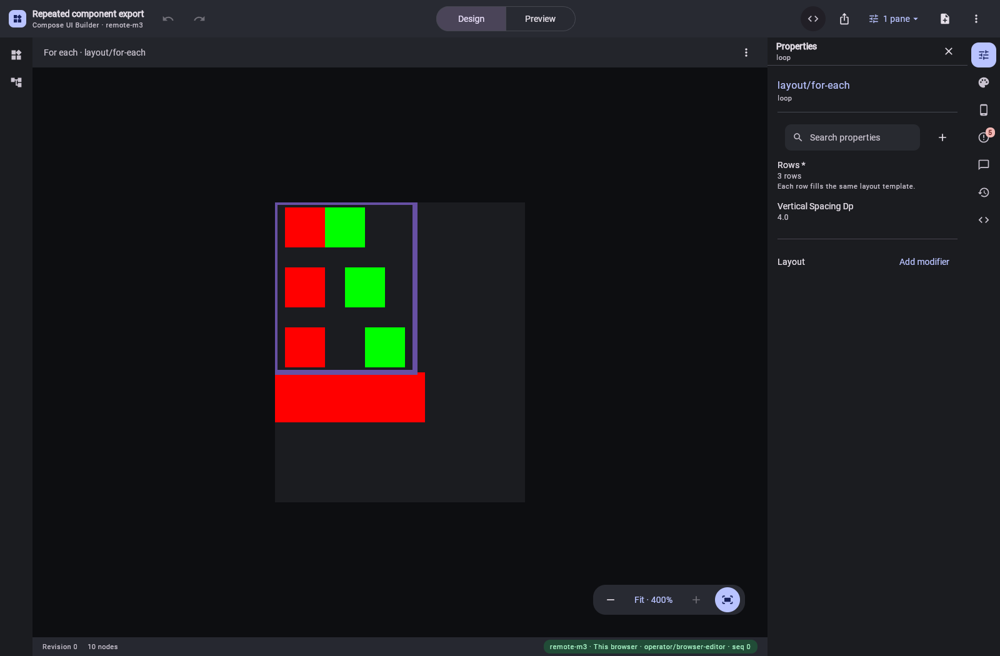
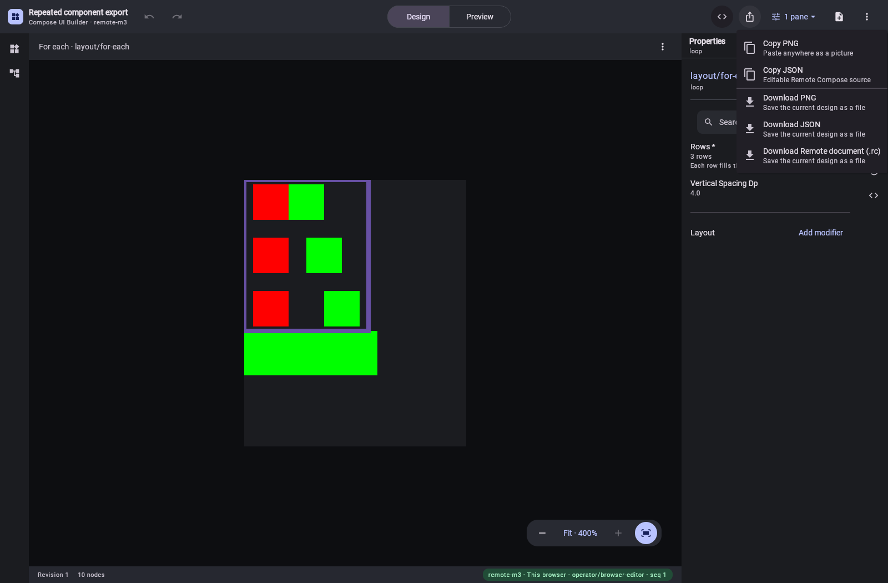

# Repeated layouts in the existing WASM editor and MCP

The [independent expansion proof](../ui-builder-repetition-proof/README.md) is now integrated into
the shared JSON exporter. The authoring tree still contains one loop, its row data, one component
definition and a placement. The exporter emits ordinary Remote layouts for those instances; it
does not replace the authored tree with the operation stream.

## What changed

- The existing `remote-m3` palette offers the existing **For each** layout. Other Remote catalogs
  receive it through the existing builder-vocabulary donor rule. The inspector displays **Rows ·
  3 rows**, rather than saying the populated data is unset.
- JSON emission resolves direct property bindings and forwarded component arguments in lexical
  scope. A placement keeps its Box wrapper, ordered modifiers and actions; a loop keeps its Column
  wrapper and spacing. Repeated selections allocate distinct expression resources.
- Browser and service catalog validation share the analysis of values supplied to template
  properties. Missing arguments and incompatible property types are rejected.
- Both reducers now recognize detached component bodies as owned by their definitions. Calls do
  not give a body extra structural parents. Existing definitions over a screen subtree remain
  valid, while component cycles and orphaned bodies are rejected.
- JSON emission is bounded to 10,000 expanded nodes and 128 levels. Malformed rows, missing
  templates, unsupported fields and unsupported modifier bindings produce refusals instead of
  partial artifacts. Runtime lists and scoped mutable state remain separate work.

## Real browser and service proof

`RemotePngExportProofTest`, with `VERIFY_REMOTE_REPETITION_BROWSER=true`, plays the compiled bytes
through the packaged renderer at densities 1 and 2, then opens the actual WASM app through a local
HTTP server. `verify-remote-repetition-export.mjs` performs the browser and hosted MCP checks:

1. Open a local design holding three rows and one reusable Pair definition. Confirm the inspector
   reports three rows, then click all six cells in the existing Preview pane. Each green cell
   selects 20; each red cell restores 10. The displayed indicator is checked after every click.
2. Download JSON, RC and PNG through the normal Export menu. Compare every downloaded file with
   an independent `ui_builder_export_document` artifact and its SHA-256.
3. Change the initial state from 10 to 20 through the Screen state editor. Reload and download all
   three formats again, checking the retained edit, component definition, row data and MCP parity.
4. Separately create a saved design through `ui_builder_create_design`; change every row's gap by
   4 through `ui_builder_apply`; read revision 1 and export it. The definition remains unchanged,
   and saved and supplied-document JSON exports agree exactly.

All six browser downloads match MCP. All six live clicks select the expected state. There are no
browser errors, and the browser's local design is never saved on the server. The separate saved
MCP design is intentional. The verification JSON records these as distinct checks.





These are actual screenshots of the existing app. The simple coloured cells make spacing, state
and individual hit regions measurable; they are not mockups or replacement catalog components.

| Artifact | Initial state 10 SHA-256 | Edited state 20 SHA-256 |
| --- | --- | --- |
| JSON | `72b4b5e5bc4679a1ea89af63f4c0f19acf343c7dd7cc7b25f9e0ad4ed81009d1` | `3b1112d06dd0cb6e540f3d6e52e4aec384cfcfd1a5cbe9874659a04406023578` |
| RC | `5b9caaa5fe917cf3c2c77efa4a5c280bd6b7f8fcd8db8859a03a9fd6e350ea9f` | `0ee73ab8f85b6080b08883742e380dc29969cfcea29563e202ff3ea4e59f7259` |
| PNG | `083a742ccff0138dc547e595e54e0762d5b4f969f77d108e5b6cff88c1549d7e` | `f20482bd25a101dec0cad169fae15adf44e2dc43f71dd6b0ff5c16fff993eae9` |

The MCP row edit produces JSON digest
`4969e7c0d36cc45cddbe9eea197a067c2401bc00b01fb8520928777d32146421`.
Authored documents, all six artifacts, live captures and `repetition-verification.json` are adjacent.

## Reproduce

Use the existing explicit local dependency manifest; no release is required:

```sh
./gradlew -PlocalDependencies=build/local-dependencies/remote-export/local-dependencies.properties \
  :ui-builder-export:jvmTest :ui-builder-runtime:test :ui-builder-runtime:checkKotlinAbi \
  :ui-builder:jvmTest :ui-builder:wasmFrontendDist :server:installDist
VERIFY_REMOTE_PNG_EXPORTS=true VERIFY_REMOTE_PNG_BROWSER=true VERIFY_REMOTE_REPETITION_BROWSER=true \
  CHROME_PATH='/Applications/Google Chrome.app/Contents/MacOS/Google Chrome' \
  UI_BUILDER_REAL_RENDER_APP_HOME="$PWD/server/build/install/compose-preview-server" \
  ./gradlew --no-configuration-cache -I preview-harness/java21-render-proof.init.gradle \
  -PlocalDependencies=build/local-dependencies/remote-export/local-dependencies.properties \
  :server:test --tests '*RemotePngExportProofTest' --rerun
```

The shared exporter suite passes 65 tests; the runtime passes 191 tests and its ABI check. The
editor passes 954 tests, with the separate opt-in JVM canvas proof skipped in the ordinary suite.
That earlier proof remains an independent oracle: the production emitter must match its expanded
document output exactly.

The final targeted server run passes 37 catalog, JSON/PNG export and hosted MCP tests. It needed
`VERIFY_LOCAL_LAYOUT_CLICKS=true` at the time to select the staged generator's supported callback
path; the released generator carries that path now, so the variable is gone and the tests assert
the emitted source directly.
Kotlin formatting and the project boundary check pass. Required golden regeneration adds only the
For each capability and its slot-acceptance entries to the existing Remote catalog fixtures.

## Remaining scope

This completes the static authored-row JSON/RC/PNG path, including browser edits and hosted MCP
authoring/export. Remote Kotlin emits a named refusal for loops; record-driven Compose loops and
reusable calls still need implementation. The existing Issues badge can therefore still report
Kotlin-export restrictions for this fixture. Per-instance MCP inspection/action addressing,
callback/slot parameters, runtime list updates, lazy keys and independent per-instance state are
not established by these physical-click tests. The full operation coverage goal remains open.
