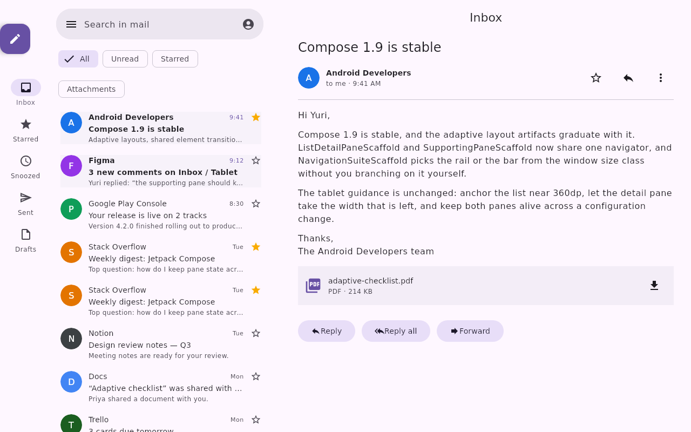

# Canonical live designs, captured in Git

The existing Google app designs on `https://preview.coo.ee` are canonical. This is an intentional
exception to repository-owned fixture authoring: Git records snapshots for review, reproducibility
and recovery; it does not become a second editing home. The owner confirmed this policy on
5 October 2026.

Each JSON file is the exact document returned by `ui_builder_get_design`, including the live
revision, catalog pin, environment, user-authored nodes and server `home`. `index.json` records its
source URL, capture time and SHA-256 of the committed UTF-8 file bytes. Credentials, presence,
access grants and comment conversations are excluded. Discussion remains at the live design.

| Design | Captured revision | Change made on the canonical server |
| --- | --- | --- |
| Gmail | 14 | Recorded server home; migrated only the scaffold to list-detail, fixed 400 dp inbox, adaptive mode. All existing content nodes retained. |
| Calendar | 2 | Recorded server home; supporting pane uses adaptive mode and a fixed 380 dp supporting width. All content retained. |
| Photos | 1 | Recorded server home; content unchanged. |
| Keep | 1 | Recorded server home; content unchanged. |
| Play | 1 | Recorded server home; content unchanged. |

The migration compared every unrelated node with the pre-migration snapshot for equality, including
Gmail's user-added duplicate messages. Live revision history was preserved; no document was replaced
with a repository fixture. Metadata-only home declarations also create a revision.

## Refreshing a snapshot

1. Obtain a read grant and read the live design, home, links and comments. Never save the grant.
2. Save only `response.snapshot.state.document` as `<designId>.json`, preserving its revision and
   server home. Do not convert it to a revision-zero import document.
3. Update the manifest's revision, capture time and file SHA-256. Check the live revision once more;
   if it moved, capture it again before committing a claim that this is the latest revision.
4. Validate the saved revision through the deployed validator and export it. For visible changes,
   inspect rendered output. Commit the snapshot diff through a PR.

Edit the canonical live document with typed operations quoting its latest revision, then refresh
Git. Do not edit these snapshots and import them back; do not configure a fixture publisher to
restore these files over live designs. An intentional rollback must be a separately reviewed
in-place change that preserves history and intervening edits.

`../fixtures/ui-builder/designs/` continues to hold reproducible render/test examples. They are not
authoritative copies of these five live designs and must never replace them. The new Docs example
currently exists only as a repository fixture; it is not included in this live snapshot set.

## Verification of this capture

On server 3.103.0, all five saved designs passed document validation and Compose export. Gmail r14
and Calendar r2 also passed deployed native compilation/rendering with nonempty node bounds and no
`UNEXPRESSIBLE_DOCUMENT` refusal. Their canvas PNG exports were visually inspected below; these are
live saved revisions at their tablet environment, not editor viewport screenshots. All five had zero
comment threads, and a final read confirmed the captured documents were unchanged.

| Gmail r14 | Calendar r2 |
| --- | --- |
|  |  |

This migration does not implement Gmail message selection/back or a Calendar supporting-pane reveal
control on phones. The live template chooser and compact native renders remain separate checks;
these successful tablet renders do not prove them.
