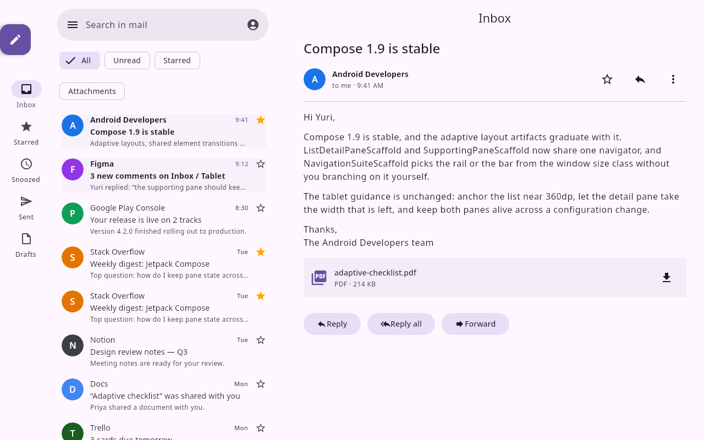
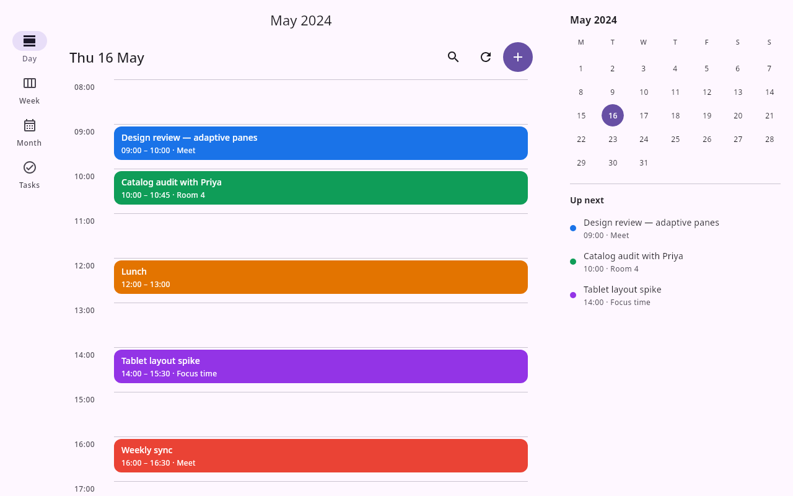
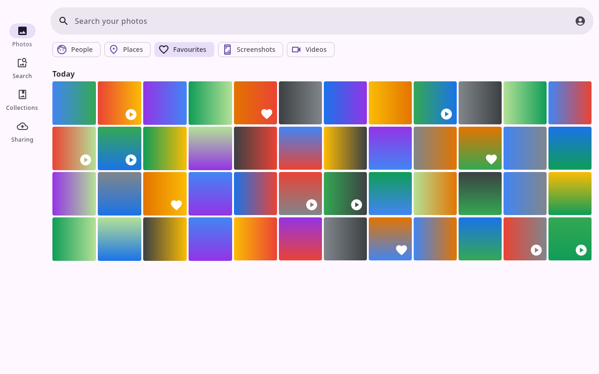
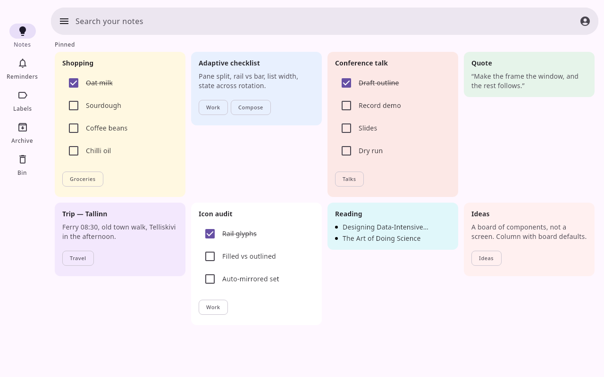
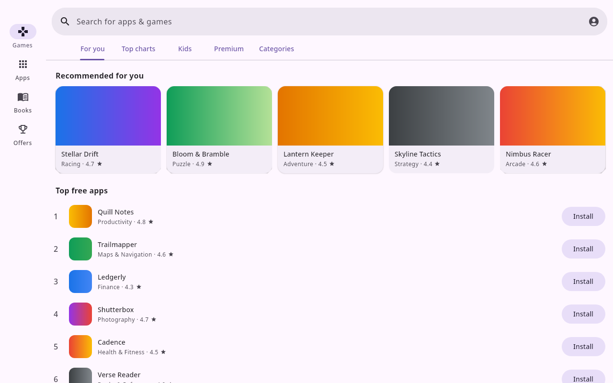

# Canonical live designs, captured in Git

The existing Google app designs on `https://preview.coo.ee` are canonical. This is an intentional
exception to repository-owned fixture authoring: Git records snapshots for review, reproducibility
and recovery; it does not become a second editing home. The owner confirmed this policy on
5 October 2026.

Each JSON file is the exact document returned by `ui_builder_get_design`, including the live
revision, catalog pin, environment, user-authored nodes and server `home`. `index.json` records its
source URL, capture time and SHA-256 of the committed UTF-8 file bytes. Credentials, presence,
access grants and comment conversations are excluded. Discussion remains at the live design.

| Design | Captured revision | Change made on the canonical server |
| --- | --- | --- |
| Gmail | 15 | 12 email summaries share read/unread components; sender, time, subject and snippet are arguments. |
| Calendar | 3 | Five event cards share title, schedule and color arguments. |
| Photos | 2 | 48 tiles use shared gradient and badge components. |
| Keep | 2 | 17 note-content, checklist and bullet items use shared components. |
| Play | 2 | Five featured app cards share their artwork, title and rating content. |

The earlier adaptive scaffold migrations and user-added Gmail duplicates remain intact. These
extractions used typed mutations against the live revisions, preserving history and item content.
Keyed Keep/Play card hosts remain outside the reusable bodies. The bodies are stored once under
`components`; placements supply `component.arguments`. See the
[production consumer](../../../ui-builder-production-consumer/README.md#google-app-item-components)
for corresponding Kotlin components and data classes, including the repository-only Docs example.

## Refreshing a snapshot

1. Obtain a read grant and read the live design, home, links and comments. Never save the grant.
2. Save only `response.snapshot.state.document` as `<designId>.json`, preserving its revision and
   server home. Do not convert it to a revision-zero import document.
3. Update the manifest's revision, capture time and file SHA-256. Check the live revision once more;
   if it moved, capture it again before committing a claim that this is the latest revision.
4. Validate the saved revision through the deployed validator and export it. For visible changes,
   inspect rendered output. Commit the snapshot diff through a PR.

Edit the canonical live document with typed operations quoting its latest revision, then refresh
Git. Do not edit these snapshots and import them back; do not configure a fixture publisher to
restore these files over live designs. An intentional rollback must be a separately reviewed
in-place change that preserves history and intervening edits.

`../fixtures/ui-builder/designs/` continues to hold reproducible render/test examples. They are not
authoritative copies of these five live designs and must never replace them. The new Docs example
currently exists only as a repository fixture; it is not included in this live snapshot set.

## Verification of this capture

All five saved designs passed deployed document validation, Compose export and native
compilation/rendering on server 3.103.0. All five had zero comment threads. Local editor renders of
the pre-extraction and extracted documents had zero changed pixels at 1280×800.

**Known deployed export bug:** the PNG/SVG projection in 3.103.0 drops `components` and each node's
`component` placement, so PNG export shows unsupported-component placeholders even though the
editor and native Kotlin export support them. This change fixes that projection and adds both a
wire-level regression test and a pixel comparison across these five snapshots. The fix needs a
builder release and host deployment; successful native compilation alone does not prove the PNG
endpoint is fixed.

The images below are **local canvas renders of the saved live documents**, not deployed PNG exports
or editor viewport screenshots. They show the corrected renderer projection and are reproduced by
`GoogleItemSnapshotRenderingTest` under `ui-builder/build/reports/google-items/`.

| Gmail r15 | Calendar r3 |
| --- | --- |
|  |  |

| Photos r2 | Keep r2 | Play r2 |
| --- | --- | --- |
|  |  |  |

This extraction does not implement Gmail message selection/back or a Calendar supporting-pane
reveal control on phones. These tablet checks do not prove those interactions.
