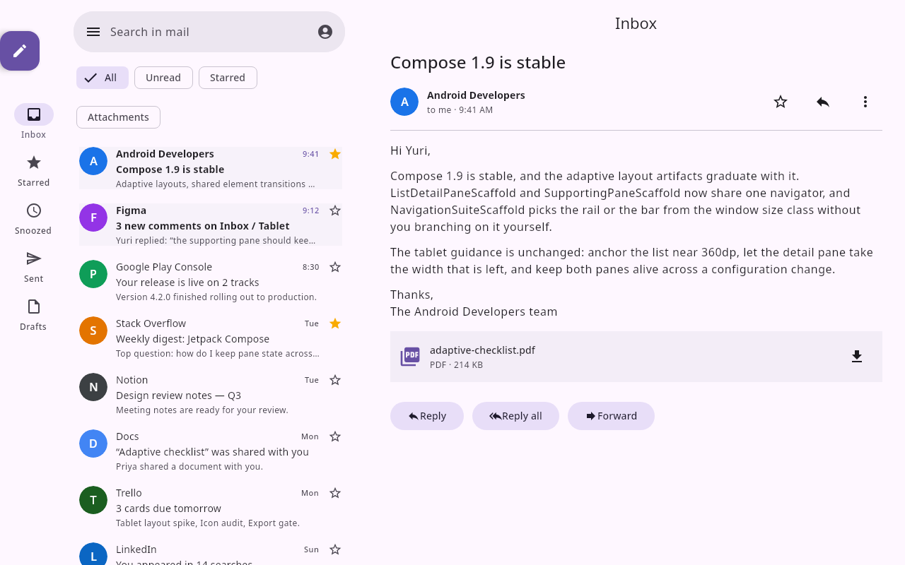
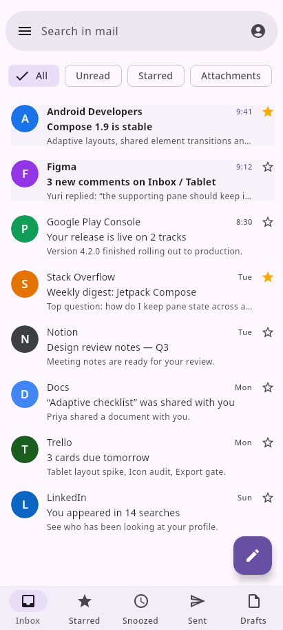
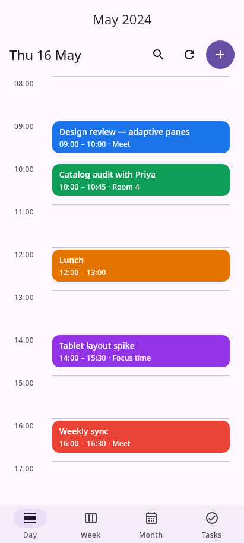
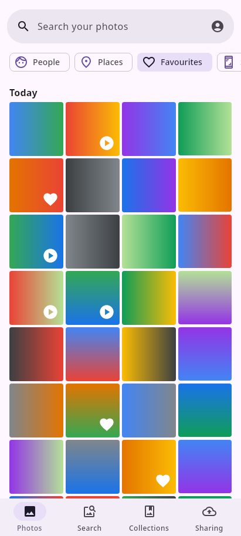
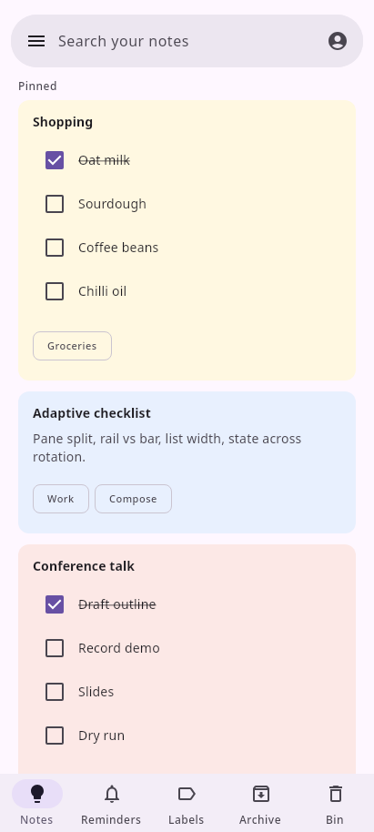
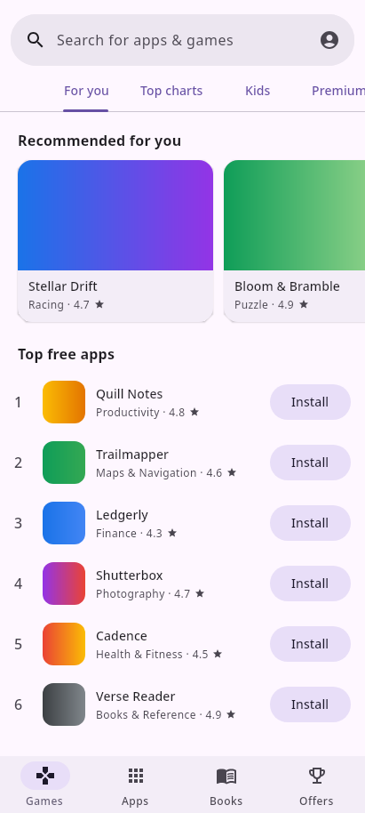
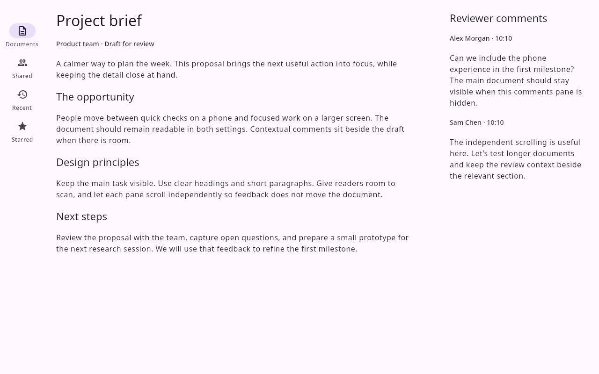
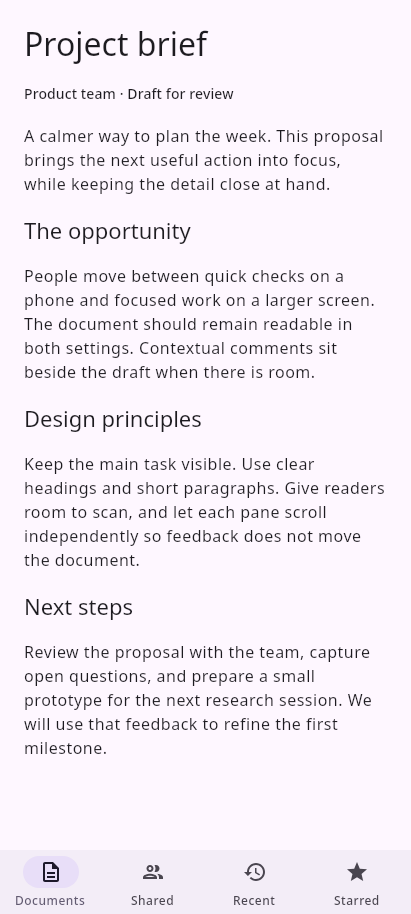

# Six adaptive Google app examples

Native Compose canvas captures of the repository fixtures proposed in this change, not deployed
saved designs and not editor viewport screenshots. Captured on 5 October 2026 with the same document
at 1280 × 800 dp and 411 × 914 dp, density 1, light theme, settled animations and the fixture's
fixed clock. Every image was visually inspected. Medium 841 × 701 dp is also tested.

All six show a navigation rail on the tablet and bottom navigation on the phone. The tests replay
and validate the fixtures and check both Compose export paths. The PR's Design Renders job separately
compiles generated source against the real m3-catalog bundle; canvas captures alone do not prove that lane.

## Gmail

A fixed 400 dp inbox sits beside a flexible reading pane. The phone shows the inbox. The fixture has no event bindings, so opening a message and returning is not implemented here. The separate stateful template test does not establish Gmail interaction history, system back or predictive back.

| Tablet · 1280 × 800 | Phone · 411 × 914 |
| --- | --- |
|  |  |

## Calendar

The flexible day view stays visible on the phone. The fixed 380 dp month/Up next pane provides context on the tablet; it is hidden on the phone, with no reveal control in this static example.

| Tablet · 1280 × 800 | Phone · 411 × 914 |
| --- | --- |
|  |  |

## Photos

The adaptive grid uses 90 dp minimum cells: 12 columns on the tablet, four on the phone. The grid scrolls vertically and filters scroll horizontally. Gradient tiles are sample artwork, not real photos.

| Tablet · 1280 × 800 | Phone · 411 × 914 |
| --- | --- |
|  |  |

## Keep

The adaptive notes grid uses 240 dp minimum cells: four columns on the tablet and one on the phone. Variable note lengths and chips remain inside vertically scrolling content; this is a regular grid, not a masonry layout.

| Tablet · 1280 × 800 | Phone · 411 × 914 |
| --- | --- |
|  |  |

## Play

A vertically scrolling discovery feed contains horizontally scrolling recommendation rows. The phone shows partial next cards as a scroll affordance. No second pane is added.

| Tablet · 1280 × 800 | Phone · 411 × 914 |
| --- | --- |
|  |  |

## Docs

The document and contextual reviewer comments use a 70/30 split with a 24 dp gutter and independent lazy-column scroll states. A rendered-boundary assertion checks the split. The phone retains the document and hides comments, with no reveal control. This does not demonstrate automatic three-pane policy, drag handles or persisted resizing.

| Tablet · 1280 × 800 | Phone · 411 × 914 |
| --- | --- |
|  |  |

## Deployment evidence and remaining checks

On 5 October 2026, both [version](https://preview.coo.ee/version) and
[status](https://preview.coo.ee/status.json) report **3.102.0**. The deployed release tag is one commit
behind required server merge `2076ca1d7544d7f2cdca55fe0037f8cb79b5ad29`; its packaged foundation
record has no `layout/list-detail-pane-scaffold`. [Release PR #1370](https://github.com/yschimke/compose-preview-server/pull/1370)
remains open. Nothing in this change deploys or merges that release.

Server health is degraded, with 39 of 40 catalogs loaded. The failed catalog is
`element-hq-element-x-android`, whose published `catalog.json` could not be fetched.

The live builder HTML is reachable. That does not verify the five-template chooser. A read/export
grant was requested, but approval was still pending during this verification. Current saved revisions,
canonical homes, links, comments, deployed validation/export/native rendering and receiver scopes
therefore remain unverified. The previous handover reported Gmail revision 12 on a supporting-pane
scaffold with no exposed canonical home; this is historical evidence, not a fresh live read.
No live design was changed or re-imported, and no Figma write was made.

Do not mark all fixes deployed until the release, packaged record, chooser and saved-design checks
pass. Establish Gmail's canonical home before any migration and preserve its revision history.
